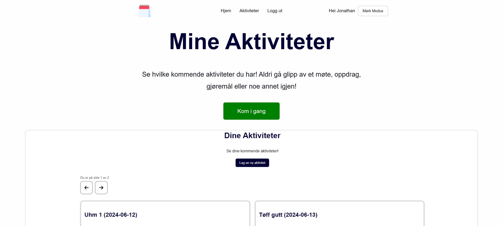

# My activities frontend

</img>

This repository contains a React frontend application that displays your upcoming activities fetched from a backend Spring Boot application.

View the site at ...

View the backend at [https://github.com/JonathanD01/my-activities-api](https://github.com/JonathanD01/my-activities-api)

## Features
- Display your upcoming activities
- Update your activities
- Delete your activities
- Registration
- Login
- Email verification

## Build
1. Clone the repository
2. Navigate to the project directory
3. Build project with `docker-compose up --build` & access page on `http://localhost`

### Emails
Emails can be accessed at `http://localhost:8025/`

## Requirements
- Node.js
- Docker (for containerization)
